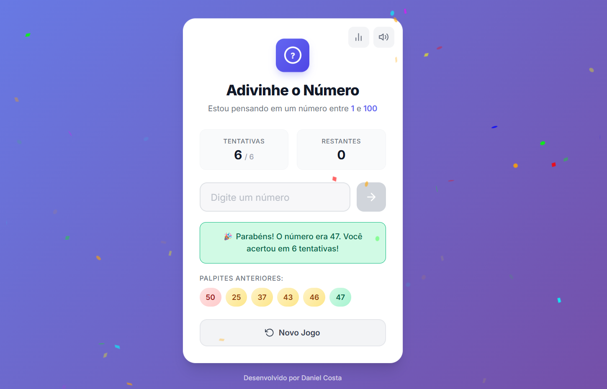

# 🎮 Adivinhe o Número - Do Zero ao Herói

Um jogo interativo desenvolvido com **HTML5**, **CSS3** e **JavaScript Vanilla**, demonstrando padrões profissionais de desenvolvimento web.

## 🚀 [Jogar Agora](https://danielcosta010.github.io/Jogo-adivinhe-o-numero/)

---

## 📸 Screenshot



---

## ✨ Características

- ✅ Interface responsiva (desktop, tablet, mobile)
- ✅ Animações suaves e efeitos visuais
- ✅ Confetti explosivo e fogos de artifício
- ✅ Sistema de sons (com mute)
- ✅ Estatísticas persistentes (localStorage)
- ✅ Código modular profissional (IIFE pattern)
- ✅ Totalmente acessível
- ✅ Suporte a teclado (Enter)

---

## 🎯 Como Jogar

1. Digite um número entre 1 e 100
2. Pressione **Enter** ou clique no botão →
3. Receba dicas (maior/menor)
4. Acerte em até 6 tentativas
5. Veja suas estatísticas

---

## 💻 Tecnologias

- **HTML5** - Estrutura semântica
- **CSS3** - Flexbox, Grid, Animações
- **JavaScript ES6+** - IIFE, Modular, Eventos

---

## 📁 Estrutura

```
├── index.html           # Estrutura HTML
├── style.css            # Estilos CSS
├── js/
│   ├── game.js         # Lógica do jogo
│   ├── ui.js           # Interface
│   ├── effects.js      # Efeitos e sons
│   └── app.js          # Orquestração
└── sounds/             # Áudio do jogo
```

---

## 🚀 Começar Localmente

```bash
# Clone o repositório
git clone https://github.com/danielcosta010/Jogo-adivinhe-o-numero.git

# Entre na pasta
cd Jogo-adivinhe-o-numero

# Abra no navegador
# Opção 1: Clique em index.html
# Opção 2: Use Live Server (VS Code)
# Opção 3: python -m http.server 8000
```

---

## 👨‍💻 Autor

**Daniel Costa** - [GitHub](https://github.com/danielcosta010)

---

**Criado para ensinar desenvolvimento web profissional**
